# CSCE 435 Group project

## 0. Group number: 26

## 1. Group members:
1. Caroline Jia
   - Username: cjia2003
   - Algorithm: Radix Sort
2. Griffin Beaudreau
   - Username: CyberGriffin
   - Algorithm: Column Sort
3. Kaitlyn Griffin
   - Username: kaitlyngrif
   - Algorithm: Sample Sort
4. Samuel Bush
   - Username: SamShrubo
   - Algorithm: Merge Sort
5. Zhongyou Wu
   - Username: ZhongyouWuTAMU
   - Algorithm: Bitonic Sort

### 1a. Team Communication:
We will be using Discord for our team communications.

## 2. Project topic: Parallel Sorting Algorithms

### 2a. Brief project description (what algorithms will you be comparing and on what architectures)

- Bitonic Sort: A sorting algorithm that scales well with parallel computing architecture. The algorithm requires the array to be size of 2^n where n is a positive integer value. It process the array recursively as subarrays and sort them into bitonic arrays. It will be implemented on the Grace Cluster using MPI.
- Sample Sort: Implemented using MPI on the Grace cluster. Appropriately sized arrays will be generated on each process and sorted using quicksort. Samples are taken from each process's local array, and a sample is then taken from the set of samples. Using the final sample, array elements are sorted into buckets, rearranged, and sorted locally. All sub-arrays are conglomerated back together, resulting in a sorted global array.   
- Merge Sort: Implement using MPI on the Grace cluster, Multiple sub-arrays that will make up the final sorted array will be generated within each process within MPI, from there they are sorted locally using std::sort, then the process of merging each process with its neighboring processes in a loop continues until the final array is produced and all sub-arrays are merged.
- Radix Sort: Implemented using MPI on Grace cluster. The inital array will be split into multiple smaller arrays across the nodes and processors, and sorted locally using a counting sort on the current digit. Afterwards a prefix sum will be caluclated to help put the integers back into a paritally sorted array until all the digit places have een sorted resulting in a sorted global array. 
- Column Sort: A parallel sorting algorithm that is well suited for sorting data arranged in a 2D grid. The matrix is sorted column-wise, transposed, and sorted again row-wise. This process is repeated until the matrix is sorted. This algorithm will be implemented using MPI on the Grace cluster.

### 2b. Pseudocode for each parallel algorithm
- For MPI programs, include MPI calls you will use to coordinate between processes

**---Merge Sort Pseudocode---**

```c++
# Full sorting algorithm
def MergeSort(Array, arraySize) {
   MPI_Init(arguments to set up mpi)
   MPI_Comm_rank(MPI_COMM_WORLD, rank)        # set rank to this process rank
   MPI_Comm_size(MPI_COMM_WORLD, numProcs)    # get number of processes

   # divide array into local sub-arrays for each process to sort individually
   if arraySize % numProcs != 0:
      # round up for array size and any unfilled space in the sub-array can be accounted for as null   
      localArraySize = ceiling(arraySize / numProcs) 
   else:
      localArraySize = arraySize / numProcs
      
   # make local array
   arrayOffset = rank * localArraySize
   localArray = array[localArraySize]    # create buffer for receiving scattered data

   # scatter to all processes
   MPI_Scatter(Array, localArraySize, MPI_INT, localArray, localArraySize, MPI_INT, root=0, MPI_COMM_WORLD)

   # each process sorts locally using quicksort
   localQuickSort(localArray, localArraySize)

   # begin merging with neighbor processes
   step = 1
   while step < num_procs:
      # combine even and odd processes in the even process
      if (rank % (2 * step) == 0):
         if (rank + step < num_procs):
            # get sorted array from neighbor process
            receivedSize = localArraySize * step
            receivedArray = new array[receivedSize]

            MPI_Recv(receivedArray, receivedSize, MPI_INT, rank + step, 0, MPI_COMM_WORLD, MPI_STATUS_IGNORE)
   
            # Merge local array and received array using helper function defined below
            localArray = Merge(localArray, localArraySize, receivedArray, receivedSize)
            # Update local size after merge
            localArraySize = localArraySize + receivedSize  
   
      elif (rank % step == 0):
         # Send local array to neighboring process
         MPI_Send(localArray, localArraySize, MPI_INT, rank - step, 0, MPI_COMM_WORLD)

      # double step size each iteration
      step = step * 2 

   # only main process gets final sorted array
   if rank == 0 
      sortedArray = array[arraySize]
   else
      sortedArray = null

   # from all scattered processes gather into final sorted array
   MPI_Gather(localArray, localArraySize, MPI_INT, sortedArray, localArraySize, MPI_INT, root=0, MPI_COMM_WORLD)

   # only main can display / output the sorted array
   if rank == 0
      Display(sortedArray)

   # call in every process
   MPI_Finalize()
}

# helper function merges 2 already sorted arrays into 1
def Merge(Array1, array1Size, Array2, array2Size) {
   mergedArray = array[array1Size + array2Size]
   i = 0
   j = 0
   k = 0

   # compare each element until completed 1 array
   while (i < array1Size) and (j < array2Size)
      if Array1[i] < Array2[j]
         mergedArray[k] = Array1[i]
         i++
      else
         mergedArray[k] = Array2[j]
         j++
      k++

   # if unread elements in Array1 copy them to the end of mergedArray
   while i < array1Size
      mergedArray[k] = Array1[i]
      i++
      k++

   # if unread elements in Array2 copy them to the end of mergedArray
   while j < array2Size
      mergedArray[k] = Array2[j]
      j++
      k++

   return mergedArray
}
```

**---Sample Sort Pseudocode---**
```
// perform sample sort in parallel
int main(int argc, char* argv[]) {
    CALI_CXX_MARK_FUNCTION;

    double total_time, time_per_process = 0.0;
    int numtasks, taskid, N;
    int* globalArray = NULL;

    if (argc == 2) {
        N = atoi(argv[1]);  // Get the size of the array
    } else {
        printf("\n Please provide the size of the array\n");
        return 0;
    }

    MPI_Init(&argc, &argv);
    MPI_Comm_rank(MPI_COMM_WORLD, &taskid);
    MPI_Comm_size(MPI_COMM_WORLD, &numtasks);

    int localArraySize = N / numtasks;
    // should also handle when numtasks does not cleanly divide N

    int *localArray = (int*) malloc(localArraySize * sizeof(int));

    if(taskid = MASTER) { // only generate array in master process
        globalArray = generate_input_array(N);
    }

    // START OF PARALLEL SECTION
    double total_time_start = MPI_Wtime();
    double process_time_start = MPI_Wtime();
    
    // distribute elements of array to m buckets
    MPI_Scatter(globalArray, localArraySize, MPI_INT, localArray, localArraySize, MPI_INT, MASTER, MPI_COMM_WORLD);

    // sort each local array with quicksort
    quicksort(localArray, 0, localArraySize - 1);

    // draw sample of size s
    int sampleSize = numtasks - 1;
    int* localSamples = select_samples(localArray, sampleSize);

    // gather samples 
    int sampleSize = numtasks - 1;
    int* localSamples = select_samples(localArray, sampleSize);

    // sort sample and select pivots

    // globally broadcast pivots to all processes
    MPI_Bcast(pivots, numtasks - 1, MPI_INT, MASTER, MPI_COMM_WORLD);

    // partition local arrays into buckets based on pivots
    
    // exchange buckets between processes
    
    // sort received buckets

    // END OF PARALLEL SECTION
    double process_time_end = MPI_Wtime();
    
    // gather sorted subarrays back to master process
    if(taskid == MASTER) {
        // gather all subarrays
        int* sortedArray = (int*)malloc(N * sizeof(int));
        MPI_Gather(localArray, localArraySize, MPI_INT, sortedArray, localArraySize, MPI_INT, MASTER, MPI_COMM_WORLD);
    } else {
        MPI_Gather(localArray, localArraySize, MPI_INT, NULL, 0, MPI_INT, MASTER, MPI_COMM_WORLD);
    }

    
    // Record total time taken
    double total_time_end = MPI_Wtime();
    total_time = total_time_end - total_time_start;
    time_per_process = process_time_end - process_time_start;

    // use MPI_Send and MPI_Recv to gather all of the process times
    // (similarly to how it was done in previous labs)

    MPI_Finalize();
}
```

**---Radix Sort Pseudocode---**
```
MPI_Init()
MPI_Comm_rank(comm, rank);
MPI_Comm_size(comm, size);

// Scatter the array across processes
if (rank == 0) {
    int *arr = generate_input_array(N);
    // Scatter the array to all processes
    MPI_Scatter(variables);
} else {
    // Other processes
    MPI_Scatter(variables);
}

// Perform radix sort on the local portion of the array

while i < max_digits {
    // Perform counting sort at current digit
    int local_count = counting_sort_by_digit(local_arr, local_size, digit_pos, base);

    // Gather global counts from other processes
    MPI_Allgather(local_count, base, MPI_INT, global_count, base, MPI_INT, comm);
    
    // Compute prefix sums on global counts to determine offsets
    int prefix_sum = compute_prefix_sums(global_count, base);
    
    // Redistribute elements based on the computed prefix sums
    int sorted_local_arr = redistribute_elements(local_arr, local_size, digit_pos, prefix_sum, base);

    // Replace local array with the newly sorted portion
    local_arr = sorted_local_arr;
}

// Gather the locally sorted arrays back into the root process
if (rank == 0) {
    MPI_Gather(local_arr, local_size, MPI_INT, sorted_arr, local_size, MPI_INT, 0, MPI_COMM_WORLD);
} else {
    MPI_Gather(local_arr, local_size, MPI_INT, NULL, local_size, MPI_INT, 0, MPI_COMM_WORLD);
}
MPI_Finalize();

```

**---Column Sort Pseudocode---**
```
Steps:
 1: Arrange data in a matrix with r rows and c columns, where r is the number of processors and c is the numner of items per process.
 2: Sort each column using a sequential sorting algorithm (may change algorithm depending on input size).
 3: Transpose the matrix.
 4: Sort each row independently
 5: Sort each column again.
 6: Tranpose the matrix.
 7: Final column sort.
```
```c++
/*
* Include MPI header
* Include Caliper header
* Include any additional headers
* Define Constants (MASTER)
*/

int main(int argc, char *argv[]) {
   CALI_CXX_MARK_FUNCTION;

   if args invalid return 0;

   // Set up MPI environment (needs to include arguments)
   MPI_INIT();
   MPI_Comm_rank()
   MPI_Comm_size()

   // Initialize variables
   int N = atoi(argv[1])
   int P = num processors;
   int rows, N_padded, padding_size;

   // To handle cases where the total number of data elements isn't divisible by the number of processors
   // Example: N = 10 and P = 4:
   // rows = (10 + 4 - 1) / 4 = 3
   // N_padded = 3 * 4 = 12 (what it will be when padded)
   // padding_size = 12 - 10 = 2 (num of padding elements)
   rows = (N + P - 1) / P;
   N_padded = rows * P;
   padding_size = N_padded - N;

   // Local data for each processor
   int *local_array = (int*)malloc(rows * sizeof(int));

   if (taskid == MASTER) {
      int *global_data = (int*)malloc(N_padded * sizeof(int));
      
      /* Add actual data to global_data */

      /* Add padded data */
      for (int i = N; i < N_padded; ++i) {
         global_data[i] = INT_MAX;
      }

      for (int p = 0; p < P; ++p) {
         if (p == MASTER) {
            // copy local data to global data
         } else {
            // MPI_Send
         }
      }
      free(global_data)
   } else {
      // MPI_Recv
   }

   /* local column sort, marked with caliper */

   /* transpose, marked with caliper */

   /* lcaol row sort, marked with caliper */

   /* transpose, marked with caliper */

   /* local column sort, marked with caliper */

   if (taskid == MASTER) {
      int *sorted_data = (int*)malloc(N * sizeof(int));
      // copy local_data into sorted_data

      foreach p = 1; p < column, MPI_Recv(sorted_data[p*rows],rows,MPI_INIT,p,0,MPI_COMM_WORLD,MPI_STATUS_IGNORE);

      // Verify that array is sorted

      free(sorted_data);
   } else {
      MPI_SNED(local_data, rows, MPI_INT, MASTER, 0, MPI_COMM_WORLD);
   }

   free(local_data);

   mgr.flush();
   MPI_Finalize();

   return 0;
}
```

**---Bitonic Sort Pseudocode---**
```c++
swap(int* i, int* j, int direction):
   if direction == *i > *j:
      temp = *i
      i = *j
      *j = temp

merge(int start, int length, int array[], int direction):
   half = length / 2
   if(length > 1):
      for(int i = start, half):
         swap(array[i], array[i] + half, direction)
      merge(start, length, array, direction)

master_bitonic(int start, int length, int array[], int direction, int min):
   if length > min:
      int half = length/2
      master_bitonic(start, half, array, 1, min)
      master_bitonic(start + half, half, array, 0, min)
      merge(start, length, array, direction)

bitonic(int start, int length, int array[], int direction):
   if length > 1:
      int half = length/2
      bitonic(start, half, array, 1)
      bitonic(start + half, half, array, 0)
      merge(start, length, array, direction)

main():
   MPI_init()
   rank = MPI_Comm_rank()
   size = MPI_Comm_size()
   

   if(rank == MASTER): // Master process
      array = input()
      portion =  array.size / size

      for(int i = 0, size):
         MPI_SEND(buf: portion, dest: i) // Tell worker size of their portion
         MPI_SEND(buf: array.sub(i * portion, (i+1) * portion), dest: i) // Send worker their portion
      
      for(int i = 0, size):
         MPI_RECV(buf: array + i*(portion), count: portion, source: i)

      master_bitonic(0, size, array, 1, portion)    // Combine worker's array with a partial bitonic  

   else : // Worker process
      size
      array
      MPI_RECV(buf: size, count: 1, source: MASTER) // Get size of portion
      MPI_RECV(buf: array, count: size, source: MASTER) // Get portion
      bitonic(0, size, array, i % 2) // Sort incre/desc based on worker index

      MPI_SEND(buf: array, dest: MASTER) // Send sorted sub array to master
      


```
### 2c. Evaluation plan - what and how will you measure and compare
- Evaluating with multiple process counts, the total process count should always be a power of 2 (2^n processors):
  - Processor count: 2, 4, 8, 16, 32, 64, 128, 256, 512, 1024
- Using Caliper + thicket to calculate the total time taken, time per process, etc, for each algorithm with the same inputs and processor count across each
  - This method can allow us to determine which algorithms are fastest in what input context
- Adjust the following in each evaluation case to test each algorithm:
  - Input sizes, Input types:
    - Input sizes: 2^16, 2^18, 2^20, 2^22, 2^24, 2^26, 2^28
    - Input types: Sorted, Random, Reverse sorted, 1% perturbed
  - Strong scaling (same problem size, increase the number of processors/nodes)
  - Weak scaling (increase problem size, increase the number of processors)

### 3a. Caliper instrumentation

Radix Sort Call Tree
```
0.030 main
├─ 0.000 data-init-runtime
├─ 0.017 comm
│  ├─ 0.002 comm-small
│  │  ├─ 0.001 MPI_Allreduce
│  │  └─ 0.000 MPI_Allgather
│  └─ 0.013 comm-large
│     ├─ 0.001 MPI_Send
│     └─ 0.010 MPI_Recv
├─ 0.005 comp
│  ├─ 0.002 comp-small
│  └─ 0.000 comp-large
├─ 0.006 MPI_Barrier
└─ 0.000 correctness-check
   ├─ 0.000 MPI_Send
   ├─ 0.000 MPI_Recv
   ├─ 0.000 MPI_Allreduce
   └─ 0.000 MPI_Barrier
0.000 MPI_Finalize
0.000 MPI_Initialized
0.000 MPI_Finalized
0.001 MPI_Comm_dup
```

Sample Sort Call Tree
```
1.099 main
└─ 1.099 main
   ├─ 0.718 MPI_Init
   ├─ 0.000 MPI_Comm_rank
   ├─ 0.000 MPI_Comm_size
   ├─ 0.001 data_init_runtime
   ├─ 0.112 comp
   │  ├─ 0.019 comp_small
   │  └─ 0.092 comp_large
   ├─ 0.263 comm
   │  ├─ 0.257 comm_large
   │  │  ├─ 0.016 MPI_Gather
   │  │  └─ 0.241 MPI_Bcast
   │  └─ 0.006 comm_small
   │     ├─ 0.000 MPI_Alltoall
   │     ├─ 0.002 MPI_Alltoallv
   │     └─ 0.003 MPI_Gatherv
   └─ 0.001 correctness_check
```

Merge Sort Call Tree
```
0.889 main
├─ 0.867 main
│  ├─ 0.864 data_init
│  │  └─ 0.000 MPI_Init
│  ├─ 0.002 comp
│  │  ├─ 0.001 comp_small
│  │  └─ 0.001 comp_large
│  ├─ 0.002 comm
│  │  └─ 0.002 comm_large
│  │     ├─ 0.003 MPI_Recv
│  │     └─ 0.000 MPI_Send
│  └─ 0.000 correctness_check
├─ 0.000 MPI_Finalize
├─ 0.000 MPI_Initialized
├─ 0.000 MPI_Finalized
└─ 0.022 MPI_Comm_dup
```

Column Sort Call Tree
```
0.614 main
└─ 0.614 main
   ├─ 0.002 create_matrix
   ├─ 0.000 gather_final
   ├─ 0.000 step1_sort
   ├─ 0.001 step2_transpose
   ├─ 0.000 step3_sort
   ├─ 0.002 step4_transpose
   ├─ 0.000 step5_sort
   ├─ 0.000 step6_shift
   ├─ 0.000 step7_sort
   └─ 0.000 step8_unshift
```

Bitonic Sort Call Tree
```
332.070 main
├─ 0.000 MPI_Init
├─ 331.693 Whole Computation
│  ├─ 281.564 comm
│  │  ├─ 0.000 comm_small
│  │  │  └─ 0.000 MPI_Send
│  │  ├─ 201.302 comp
│  │  │  └─ 71.301 comp_large
│  │  ├─ 0.002 correctness_check
│  │  └─ 21.190 comm_large
│  │     └─ 21.190 MPI_Recv
│  ├─ 0.000 MPI_Recv
│  ├─ 0.006 data_init_runtime
│  ├─ 201.979 comp
│  │  └─ 71.532 comp_large
│  ├─ 0.004 correctness_check
│  └─ 0.001 MPI_Send
├─ 0.000 MPI_Initialized
├─ 0.000 MPI_Finalized
└─ 0.000 MPI_Comm_dup
0.000 MPI_Initialized
0.000 MPI_Finalized
249.995 MPI_Comm_dup
```

### 3b. Collect Metadata

Radix Sort Metadata

```
           cali.caliper.version  mpi.world.size  \
profile                                           
3298923211               2.11.0               4   
                                                 spot.metrics  \
profile                                                         
3298923211  min#inclusive#sum#time.duration,max#inclusive#...   
          spot.timeseries.metrics  spot.format.version  \
profile                                                   
3298923211                                            2   

                                                 spot.options  spot.channels  \
profile                                                                        
3298923211  time.variance,profile.mpi,node.order,region.co...  regionprofile   

           cali.channel spot:node.order spot:output spot:profile.mpi  \
profile                                                                
3298923211         spot            true   p4-a.cali             true   

           spot:region.count spot:time.exclusive spot:time.variance  \
profile                                                               
3298923211              true                true               true   

           		 launchdate                     libraries  \
profile                                                                     
3298923211  1729089290  [/scratch/group/csce435-f24/Caliper/caliper/li...   

                        cmdline cluster algorithm programming_model data_type  \
profile                                                                         
3298923211  [./radix_sort, 256]       c     radix               mpi       int   

            size_of_data_type  input_size input_type  num_procs scalability  \
profile                                                                       
3298923211                  4         256     Random          4      strong   

            group_num implementation_source  
profile                                      
3298923211         26           online & ai  
```

Sample Sort Metadata
```
         cali.caliper.version  mpi.world.size  \
profile                                          
743475682               2.11.0              16   

                                                spot.metrics  \
profile                                                        
743475682  min#inclusive#sum#time.duration,max#inclusive#...   

          spot.timeseries.metrics  spot.format.version  \
profile                                                  
743475682                                            2   

                                     spot.options  spot.channels cali.channel  \
profile                                                                         
743475682  node.order,region.count,time.exclusive  regionprofile         spot   

          spot:node.order                      spot:output spot:region.count  \
profile                                                                        
743475682            true  cali-samp-262144-p16-type1.cali              true   

          spot:time.exclusive  launchdate  \
profile                                     
743475682                true  1729115470   

                                                   libraries  \
profile                                                        
743475682  [/scratch/group/csce435-f24/Caliper/caliper/li...   

                         cmdline cluster   algorithm programming_model  \
profile                                                                  
743475682  [./samplesort, 18, 1]       c  samplesort               mpi   

          data_type  size_of_data_type  input_size input_type  num_procs  \
profile                                                                    
743475682       int                  4      262144     Random         16   

          scalability  group_num  \
profile                            
743475682      strong         26   

                                       implementation_source  
profile                                                       
743475682  AI and Online  
```

Merge Sort Metadata
```
           cali.caliper.version  mpi.world.size  \
profile                                           
1981606483               2.11.0              16   

                                                 spot.metrics  \
profile                                                         
1981606483  min#inclusive#sum#time.duration,max#inclusive#...   

           spot.timeseries.metrics  spot.format.version  \
profile                                                   
1981606483                                            2   

                                                 spot.options  spot.channels  \
profile                                                                        
1981606483  time.variance,profile.mpi,node.order,region.co...  regionprofile   

           cali.channel spot:node.order   spot:output spot:profile.mpi  \
profile                                                                  
1981606483         spot            true  p16-a16.cali             true   

           spot:region.count spot:time.exclusive spot:time.variance  \
profile                                                               
1981606483              true                true               true   

            launchdate                                          libraries  \
profile                                                                     
1981606483  1729133312  [/scratch/group/csce435-f24/Caliper/caliper/li...   

                              cmdline cluster   algorithm programming_model  \
profile                                                                       
1981606483  [./mergesort, 16, Random]       c  Merge Sort               mpi   

           data_type  size_of_data_type  input_size input_type  num_procs  \
profile                                                                     
1981606483       int                  4       65536     Random         16   

                  scalability  group_num implementation_source  
profile                                                         
1981606483  weak (assumption)         26      ai & handwritten  
```

Column Sort Metadata
```
cali.caliper.version  mpi.world.size  \
profile                                           
202565079                2.11.0              10   
977574015                2.11.0               3   
3024513808               2.11.0              10   
3635606938               2.11.0               2   
4276463802               2.11.0              10   

                                                 spot.metrics  \
profile                                                         
202565079   min#inclusive#sum#time.duration,max#inclusive#...   
977574015   min#inclusive#sum#time.duration,max#inclusive#...   
3024513808  min#inclusive#sum#time.duration,max#inclusive#...   
3635606938  min#inclusive#sum#time.duration,max#inclusive#...   
4276463802  min#inclusive#sum#time.duration,max#inclusive#...   

           spot.timeseries.metrics  spot.format.version  \
profile                                                   
202565079                                             2   
977574015                                             2   
3024513808                                            2   
3635606938                                            2   
4276463802                                            2   

                                      spot.options  spot.channels  \
profile                                                             
202565079   node.order,region.count,time.exclusive  regionprofile   
977574015   node.order,region.count,time.exclusive  regionprofile   
3024513808  node.order,region.count,time.exclusive  regionprofile   
3635606938  node.order,region.count,time.exclusive  regionprofile   
4276463802  node.order,region.count,time.exclusive  regionprofile   

           cali.channel spot:node.order       spot:output spot:region.count  \
profile                                                                       
202565079          spot            true    p10-a1000.cali              true   
977574015          spot            true       p3-a11.cali              true   
3024513808         spot            true   p10-a10000.cali              true   
3635606938         spot            true        p2-a4.cali              true   
4276463802         spot            true  p10-a100000.cali              true   

           spot:time.exclusive  
profile                         
202565079                 true  
977574015                 true  
3024513808                true  
3635606938                true  
4276463802                true  
```

Bitonic Sort Metadata
```
 	cali.caliper.version 	mpi.world.size 	spot.metrics 	spot.timeseries.metrics 	spot.format.version 	spot.options 	spot.channels 	cali.channel 	spot:node.order 	spot:output 	spot:region.count 	spot:time.exclusive 	user 	launchdate 	libraries 	cmdline 	cluster 	num_procs 	matrix_size 	program_name 	matrix_datatype_size 	MPI_Reduce-whole_computation_time 	MPI_Reduce-master_initialization_time 	MPI_Reduce-master_send_receive_time 	MPI_Reduce-worker_receive_time_max 	MPI_Reduce-worker_receive_time_min 	MPI_Reduce-worker_receive_time_average 	MPI_Reduce-worker_calculation_time_max 	MPI_Reduce-worker_calculation_time_min 	MPI_Reduce-worker_calculation_time_average 	MPI_Reduce-worker_send_time_max 	MPI_Reduce-worker_send_time_min 	MPI_Reduce-worker_send_time_average
profile 																																	
170336558 	2.11.0 	8 	min#inclusive#sum#time.duration,max#inclusive#... 		2 	node.order,region.count,time.exclusive 	regionprofile 	spot 	true 	128-8.cali 	true 	true 	zhongyouwu 	1727466897 	[/scratch/group/csce435-f24/Caliper/caliper/li... 	[./mpi_mm, 128] 	c 	8 	128 	master_worker_matrix_multiplication 	8 	0.024461 	0.000229 	0.024208 	0.055580 	0.023114 	0.041921 	0.011459 	0.001422 	0.003019 	0.000048 	0.000031 	0.000040
458074348 	2.11.0 	16 	min#inclusive#sum#time.duration,max#inclusive#... 		2 	node.order,region.count,time.exclusive 	regionprofile 	spot 	true 	128-16.cali 	true 	true 	zhongyouwu 	1727466897 	[/scratch/group/csce435-f24/Caliper/caliper/li... 	[./mpi_mm, 128] 	c 	16 	128 	master_worker_matrix_multiplication 	8 	0.077896 	0.000243 	0.077624 	0.123626 	0.000429 	0.074863 	0.000741 	0.000642 	0.000696 	0.000048 	0.000035 	0.000041
802824523 	2.11.0 	16 	min#inclusive#sum#time.duration,max#inclusive#... 		2 	node.order,region.count,time.exclusive 	regionprofile 	spot 	true 	1024-16.cali 	true 	true 	zhongyouwu 	1727466954 	[/scratch/group/csce435-f24/Caliper/caliper/li... 	[./mpi_mm, 1024] 	c 	16 	1024 	master_worker_matrix_multiplication 	8 	5.962221 	0.112963 	5.849179 	0.525303 	0.206468 	0.364798 	5.638342 	5.240062 	5.426046 	0.030461 	0.000195 	0.003998
1325292579 	2.11.0 	32 	min#inclusive#sum#time.duration,max#inclusive#... 		2 	node.order,region.count,time.exclusive 	regionprofile 	spot 	true 	1024-32.cali 	true 	true 	zhongyouwu 	1727466954 	[/scratch/group/csce435-f24/Caliper/caliper/li... 	[./mpi_mm, 1024] 	c 	32 	1024 	master_worker_matrix_multiplication 	8 	8.474886 	0.220471 	8.254303 	1.513168 	0.375166 	1.002473 	7.094080 	5.674065 	6.319820 	0.066136 	0.000126 	0.007246
2875060761 	2.11.0 	64 	min#inclusive#sum#time.duration,max#inclusive#... 		2 	node.order,region.count,time.exclusive 	regionprofile 	spot 	true 	128-64.cali 	true 	true 	zhongyouwu 	1727466898 	[/scratch/group/csce435-f24/Caliper/caliper/li... 	[./mpi_mm, 128] 	c 	64 	128 	master_worker_matrix_multiplication 	8 	0.193155 	0.000243 	0.192825 	0.250448 	0.000171 	0.085454 	0.014162 	0.000168 	0.000631 	0.000063 	0.000028 	0.000033
2896985760 	2.11.0 	2 	min#inclusive#sum#time.duration,max#inclusive#... 		2 	node.order,region.count,time.exclusive 	regionprofile 	spot 	true 	1024-2.cali 	true 	true 	zhongyouwu 	1727466897 	[/scratch/group/csce435-f24/Caliper/caliper/li... 	[./mpi_mm, 1024] 	c 	2 	1024 	master_worker_matrix_multiplication 	8 	10.373385 	0.010415 	10.362917 	0.021158 	0.021158 	0.021158 	10.351604 	10.351604 	10.351604 	0.003412 	0.003412 	0.003412
3146970658 	2.11.0 	2 	min#inclusive#sum#time.duration,max#inclusive#... 		2 	node.order,region.count,time.exclusive 	regionprofile 	spot 	true 	128-2.cali 	true 	true 	zhongyouwu 	1727465561 	[/scratch/group/csce435-f24/Caliper/caliper/li... 	[./mpi_mm, 128] 	c 	2 	128 	master_worker_matrix_multiplication 	8 	0.019298 	0.000279 	0.018984 	0.010334 	0.010334 	0.010334 	0.010818 	0.010818 	0.010818 	0.000068 	0.000068 	0.000068
3258936128 	2.11.0 	32 	min#inclusive#sum#time.duration,max#inclusive#... 		2 	node.order,region.count,time.exclusive 	regionprofile 	spot 	true 	128-32.cali 	true 	true 	zhongyouwu 	1727466897 	[/scratch/group/csce435-f24/Caliper/caliper/li... 	[./mpi_mm, 128] 	c 	32 	128 	master_worker_matrix_multiplication 	8 	0.217835 	0.000286 	0.217514 	0.358161 	0.146064 	0.253260 	0.000667 	0.000332 	0.000360 	0.001665 	0.000029 	0.000090
3263988617 	2.11.0 	64 	min#inclusive#sum#time.duration,max#inclusive#... 		2 	node.order,region.count,time.exclusive 	regionprofile 	spot 	true 	1024-64.cali 	true 	true 	zhongyouwu 	1727466955 	[/scratch/group/csce435-f24/Caliper/caliper/li... 	[./mpi_mm, 1024] 	c 	64 	1024 	master_worker_matrix_multiplication 	8 	12.363227 	0.318166 	12.044952 	4.062414 	0.473372 	2.416818 	10.249945 	6.819659 	8.160158 	0.117756 	0.000096 	0.005823
3434837044 	2.11.0 	4 	min#inclusive#sum#time.duration,max#inclusive#... 		2 	node.order,region.count,time.exclusive 	regionprofile 	spot 	true 	128-4.cali 	true 	true 	zhongyouwu 	1727466846 	[/scratch/group/csce435-f24/Caliper/caliper/li... 	[./mpi_mm, 128] 	c 	4 	128 	master_worker_matrix_multiplication 	8 	0.026028 	0.000254 	0.025743 	0.033771 	0.015406 	0.027525 	0.003430 	0.003333 	0.003391 	0.000077 	0.000051 	0.000063
4202622048 	2.11.0 	8 	min#inclusive#sum#time.duration,max#inclusive#... 		2 	node.order,region.count,time.exclusive 	regionprofile 	spot 	true 	1024-8.cali 	true 	true 	zhongyouwu 	1727466954 	[/scratch/group/csce435-f24/Caliper/caliper/li... 	[./mpi_mm, 1024] 	c 	8 	1024 	master_worker_matrix_multiplication 	8 	6.465010 	0.040723 	6.424182 	0.192274 	0.076241 	0.152816 	6.308338 	6.006143 	6.124993 	0.024461 	0.000866 	0.006158
4288893745 	2.11.0 	4 	min#inclusive#sum#time.duration,max#inclusive#... 		2 	node.order,region.count,time.exclusive 	regionprofile 	spot 	true 	1024-4.cali 	true 	true 	zhongyouwu 	1727466897 	[/scratch/group/csce435-f24/Caliper/caliper/li... 	[./mpi_mm, 1024] 	c 	4 	1024 	master_worker_matrix_multiplication 	8 	7.564211 	0.031770 	7.532343 	0.093590 	0.067238 	0.076938 	7.483138 	7.354114 	7.410794 	0.012188 	0.002114 	0.008659
```
### 4a. Vary the following parameters
For input_size's:
- 2^16, 2^18, 2^20, 2^22, 2^24, 2^26, 2^28

For input_type's:
- Sorted, Random, Reverse sorted, 1%perturbed

MPI: num_procs:
- 2, 4, 8, 16, 32, 64, 128, 256, 512, 1024

This should result in 4x7x10=280 Caliper files for your MPI experiments.

### 4b. Hints for performance analysis

To automate running a set of experiments, parameterize your program.

- input_type: "Sorted" could generate a sorted input to pass into your algorithms
- algorithm: You can have a switch statement that calls the different algorithms and sets the Adiak variables accordingly
- num_procs: How many MPI ranks you are using

When your program works with these parameters, you can write a shell script 
that will run a for loop over the parameters above (e.g., on 64 processors, 
perform runs that invoke algorithm2 for Sorted, ReverseSorted, and Random data).  

### 4c. You should measure the following performance metrics
- `Time`
    - Min time/rank
    - Max time/rank
    - Avg time/rank
    - Total time
    - Variance time/rank
 
#### Radix Sort Performance Evaluation:
Hydra errors in the grace cluster made it borderline impossible to consistently run 512 and 1024 processes which is why I only have one 512 run. The code becomes to slow for 2^26 elements at lower processor numbers when it takes about 2 hours for one run at 64 processors. The reason for the delay is probably that there is a lot of sending happening that could probably be optimized but I don’t know how to optimize it yet so I can’t run the largest problem size. 
##### Strong Scaling Avg Time/Rank Graphs 
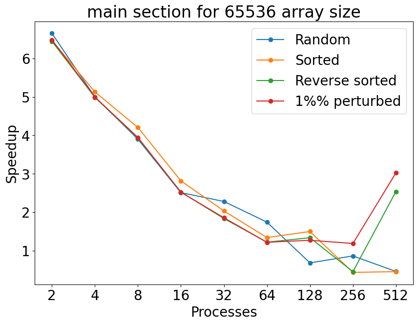


There is a general downward trend for all the graph and almost all of them have a spike when reaching 32 processors. The decreasing trend can be attributed to the local array shriking and the proccors having the communicate less when the number of processors goes up since the problem size stays the same. 
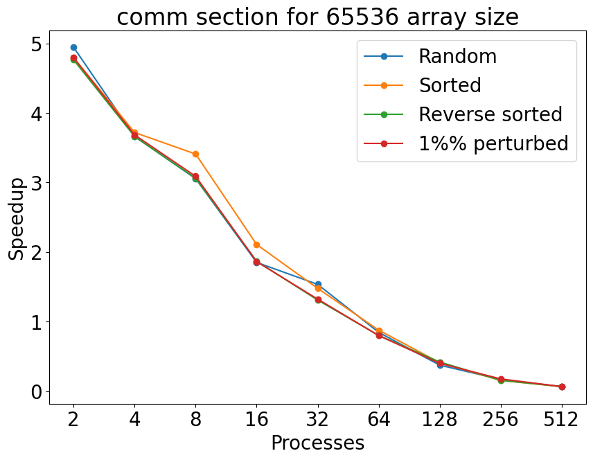
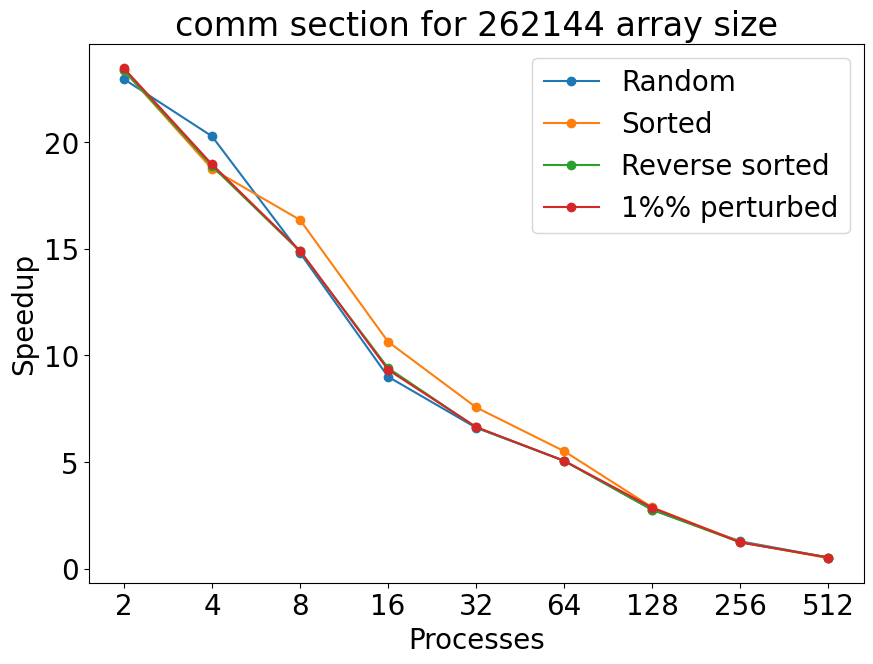
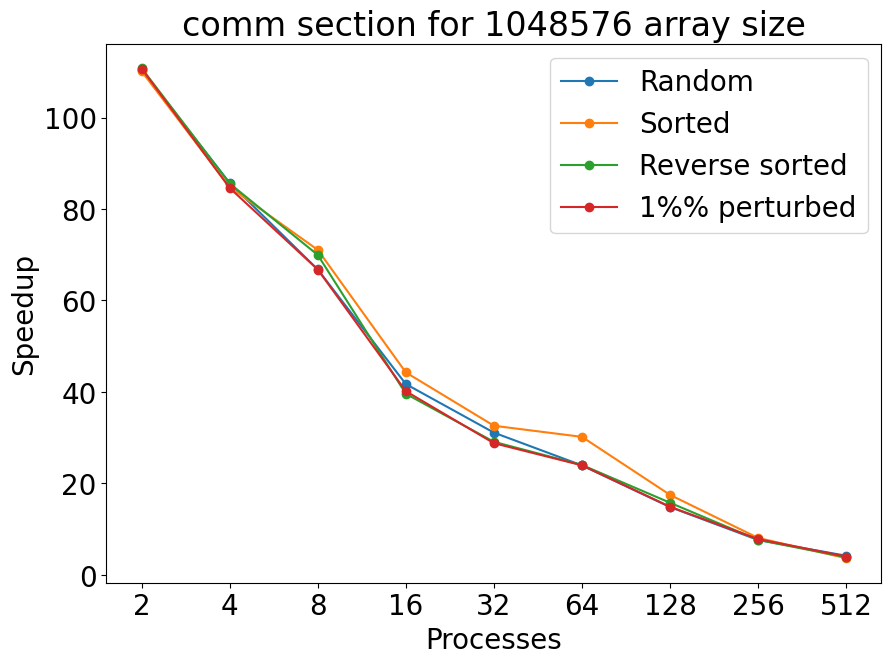

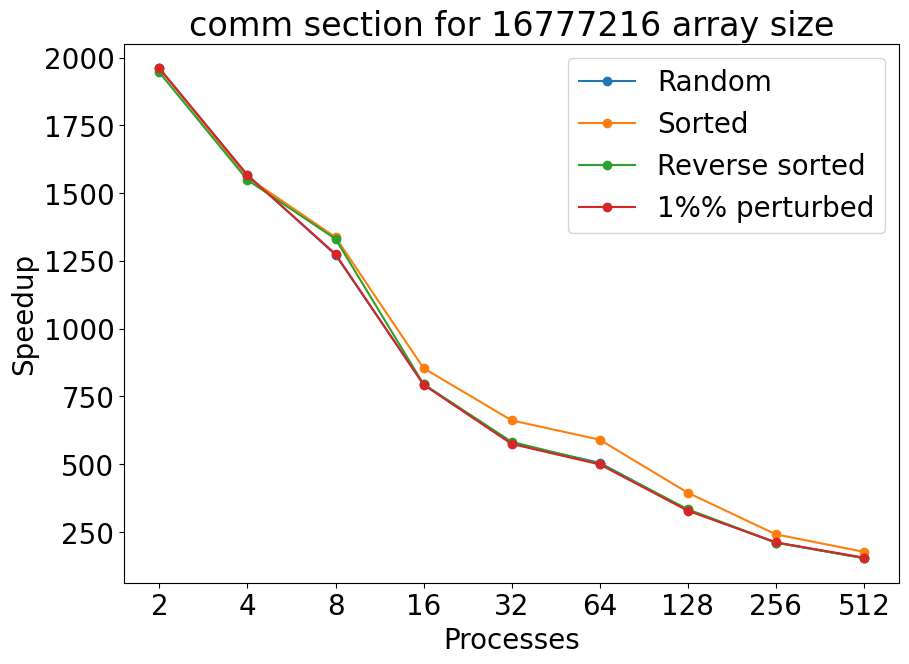

There is a general downward trend for all the graph but other than that there isn't much similarity across all the graphs. The decreasing trend can be attributed to the local array shriking and the proccors having the communicate less when the number of processors goes up since the problem size stays the same. 
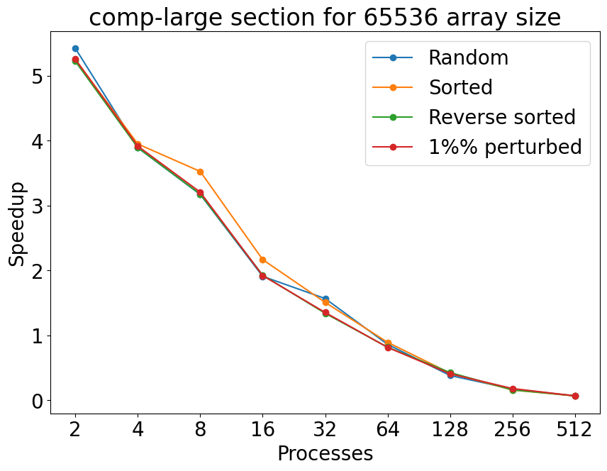

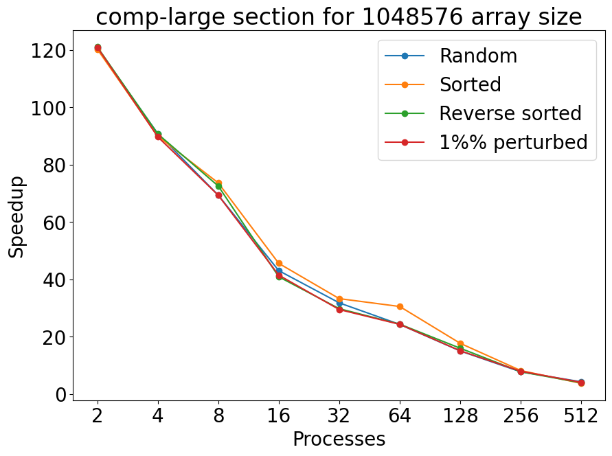


There is very little change in the speed up for computation as the number of processros increase and this is most likely due to the way the caliper barriers were placed during implementation as there were other place it should have been placed but I didn't notice it until much later. I plan on rerunning my code to get more accurate timings on my algorithim. 

##### Strong Scaling Speedup Graphs 


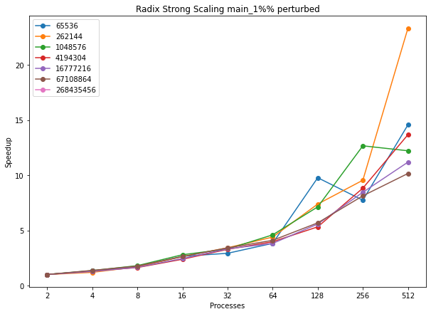
All of the graphs look similar which is to be expected since for radix sort, there is very little computation or communication difference for how the array was sorted before hand. The main section has far less speedup compared to comm and comp-large but that can be accounted by the fact that main also includes the data-init and correctness-check sections.


All of the graphs look similar which is to be expected since for radix sort, there is very little computation or communication difference for how the array was sorted before hand. The runs with the most speedup tend to be the ones with smaller processors which speaks to how much communication increases and processor count increases. 


All of the graphs look similar which is to be expceted since for radix sort, there is very little computation or communication difference for how the array was sorted before hand. The runs with the most speedup tend to be the ones with smaller processors which since in my implementation, communication is nessecary for computation to happen in the com-large section, speedup is weighted down by the acmount of communication happening. 

##### Weak Scaling Graphs 
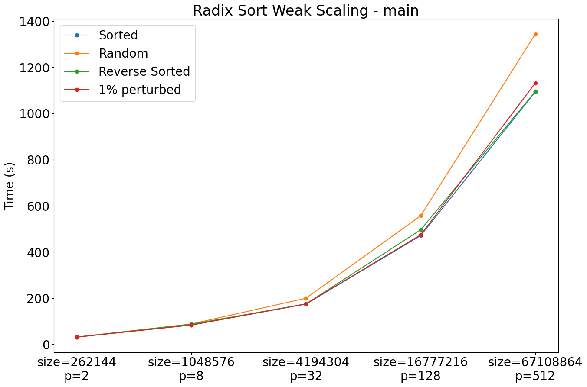


The weak scaling graphs have a general upward trend as the number of processors increase indicating that even though the number of processors and the array size increase in tandem, the amount of time per processors still increase indicating the code does not scale as expected. 


#### Sample Sort Performance Evaluation
I had issues running jobs using 1024 processors on Grace. Hydra consistently would error, and the runs would not complete. Along with this, I had issues with my larger process and input sizes having segmentation faults I was unable to fix. Because of this, I was not able to run any jobs with more than 64 processors for the 2^28 array input size. Additionally, I had the same issue with segmentation faults with a 2^26 array input size for jobs with 64, 128, and 256 processors. 

In general, it appears that communication does not scale well. Communication takes up the majority of the program's clock time. All of the collective communication calls between processes are inherently blocking, so any time not spent doing computations is spent waiting for other processes. Once computation is complete for each process, it is forced to wait at the next barrier until all processes are ready to move on. Due to its buckets, samplesort often has differences in performance time between processes depending on how many array items are sent to each process. Bad sampling can increase program time because array elements are not evenly distributed. Computation time generally acts as expected, and the time decreases as the number of process increase. However, unequal allocation of sampling elements can cause computation time to be uneven across processes, causing the average computation time to increase.   

##### Strong Scaling Time
###### 2^16 array element graphs


- As seen in the graphs, the overall time spent in main slightly increases as the process count increases. This likely has to do with the input array's size. Small coutns of array elements are sent to an increasing number of processes, and communication is less effective than computation when the array sizes are this small. The computation time decreases as the number of processes increases, likely due to each process being responsible for sorting smaller arrays as the process count increases. The computation time greatly increases as the process count increases, likelt due to the reasons discussed previously.  

###### 2^18 array element graphs


- The time spent in main slightly increases as the process count increases, other than the outlier for the 1% perturbed input with 512 processors. As discussed previously, the array input size is small at this point, so the benefits of performing computations in parallel are not yet reaped. Communication time slightly increases as the number of processors increase, and computation time decreases as each process is made responsible for smaller and smaller arrays. Although difficult to see, sorted, 1% perturbed, and reverse sorted inputs all had extremely similar computation times. These points overlap in the graph. Random inputs consistently took more time to sort than the other inputs, likely due to sorting having to actually take place. std::sort was used to sort local arrays, and it appears to be more time-efficient with already-sorted inputs.  

###### 2^20 array element graphs

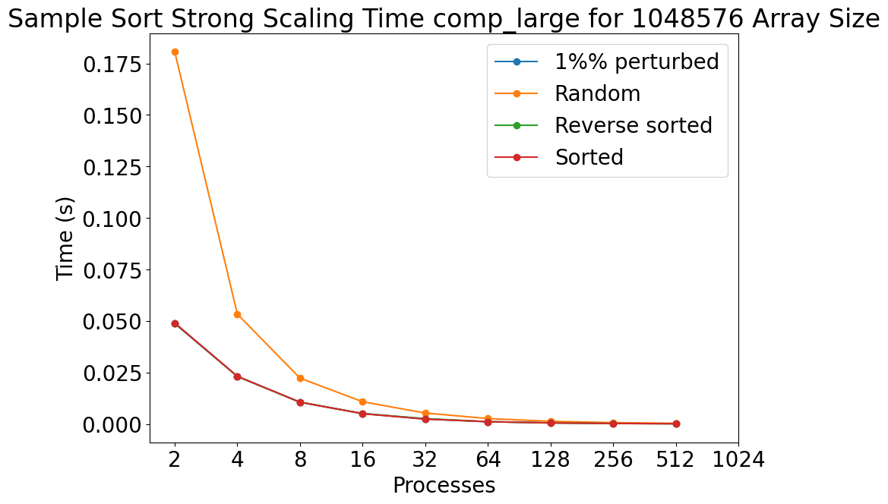
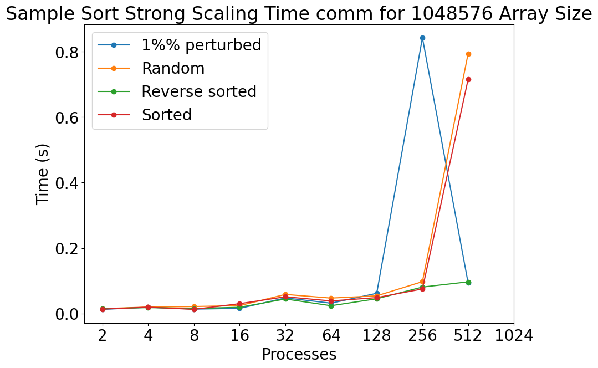
- As seen in previous graphs, the time spent in main slightly increases as the number of processes increase. Despite this, all jobs took less than three seconds to complete. Reverse sorted, 1% perturbed, and sorted inputs all had very similar computation times, and random inputs still took longer to sort, as seen in the computation graph. The communication time spikes greatly for 1% perturbed input at 256 processes and sorted and random inputs at 512 processes. These are likely outliers potentially due to nodes being far apart from each other in Grace, but the difference in time only seems so dramatic because of the other communication times being so short. All communication was complete within a second. 

###### 2^22 array element graphs
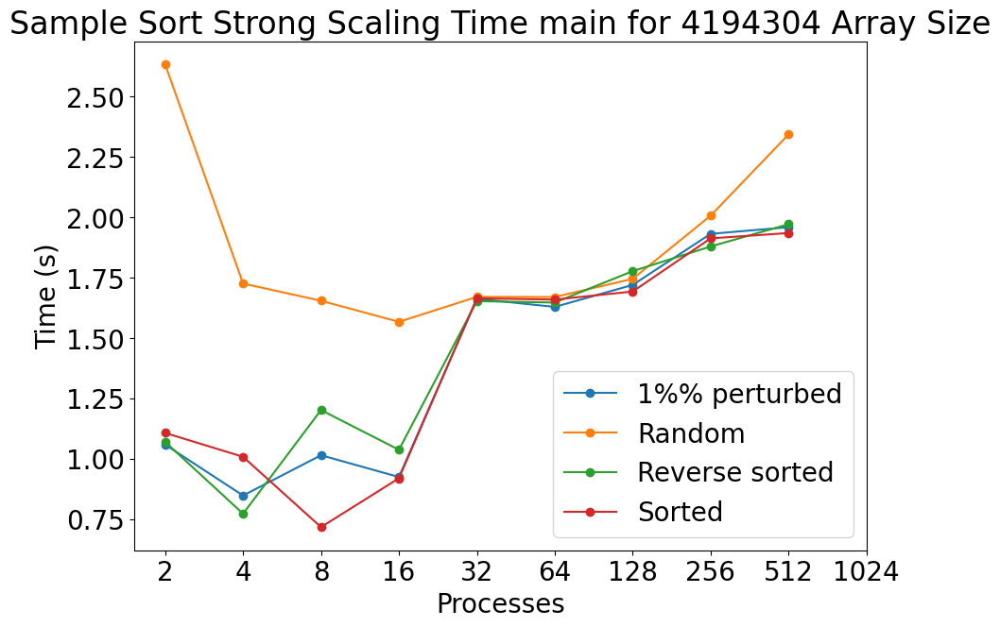

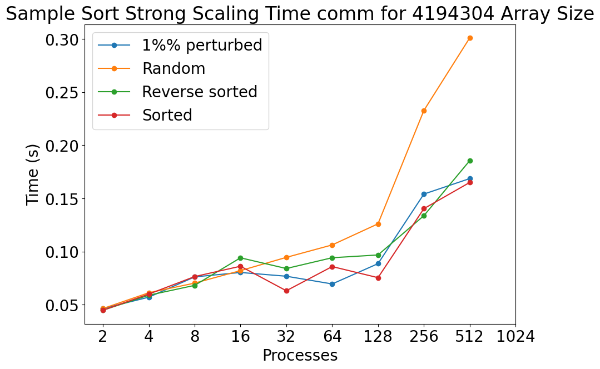
- The main graph displays a "U" pattern for random input, potentially displaying that random input is most efficient with 16, 32, and 64 processes when the array input size is 2^22 elements. The other input types all continue to have the pattern of generally increasing in time as the process count increases. As seen previously, computation time per process greatly decreases as the number of processes increase. Communication times slightly increase as the process count increases, but all communication was complete within 0.40 seconds. 

###### 2^24 array element graphs

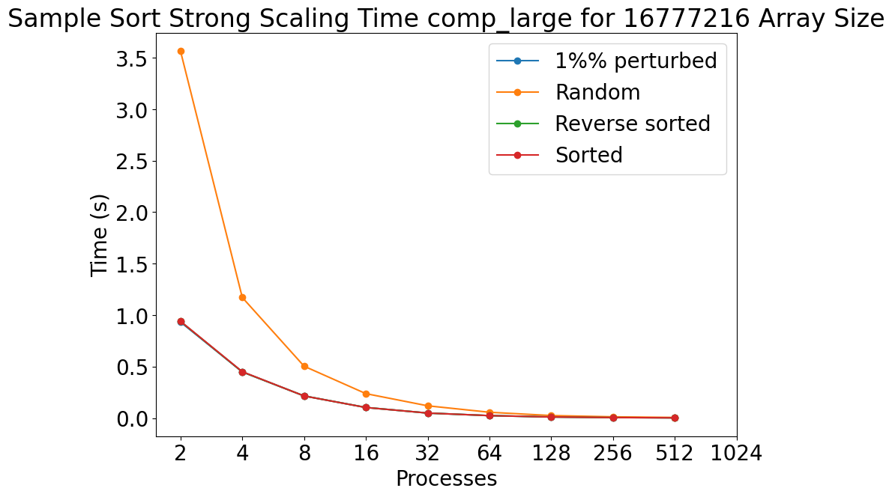

- This is the first case where the time spent in main does not increase. Random inputs greatly benefit from an increase in process counts, and reverse sorted, sorted, and 1% perturbed inputs slightly display the "U" pattern seen with random input in the 2^22 main graph. Computation continues to decrease at the process count increases. Communication steadily increases as the process count increases. 

###### 2^26 array element graphs


- This is the first graph where all input types appear to benefit from parallelization. Computation times continue to decrease as the process count increases. Communication steadily increases with the process count. With this input size, it appears that parallelization is beneficial and improves the algorithm's performance. 

###### 2^28 array element graphs


- I was not able to complete any jobs for 2^28 array input with 64 processes or greater. Despite this, There is an obvious pattern of the time spent in main dramatically decreasing as the process count increases. Computation dramatically decreases as the process count increases. Communication increases with the process count more dramatically than seen previously, but the benefit from parallelizing the computation is greater than the communication increase.  

##### Strong Scaling Speedup
###### Random Input


- The speedup displayed in main is as expected for samplesort. The speedup calculations for computation are very large, but this is due to the computation times being very fast in the first place. I used std::sort for sorting, so the process of sorting in itself is fast. Any improvements in computation time are dramatically reflected because the starting computation times are so small in the first place. Communication takes more time as the number of processes increase, causing communication to not speed up. Communication takes up much more of the time spent in main than computation, causing the overall speedup in main to be reasonable. 

###### Sorted Input


- Everything discussed for the random input strong scaling speedup graphs apply here as well.

###### Reverse Sorted Input


- Everything discussed for the random input strong scaling speedup graphs apply here as well.

###### 1% Perturbed Input


- Everything discussed for the random input strong scaling speedup graphs apply here as well.

##### Weak Scaling Time


- Generally, the time spent in main increases with the input size and process count. Random input consistently takes more time to compute and sort than the other inputs, likely due to std::sort first checking if the array it is sorting is actually sorted. Random inputs must actually be sorted, causing the increase in computation times. As the process count increases, the communication time increases as well. This is expected.  

#### Merge Sort Performance Evaluation:

There were many issues at the larger processor counts of 512 and 1024, consistent errors resulting in a lack of data for many points within 512 processors and all in 1024, this is most likely due to the excessive communication loop required to make merge sort work and it lacks scalability to higher processor counts.

##### 2^16 array element graphs


- Here computation time has a negligible influence on the total run time, meaning the algorithm is far less efficient with more processors at a higher run time due to higher communication overhead being the driving factor.

##### 2^18 array element graphs


- The same trend is observed at this array size as in 2^16

##### 2^20 array element graphs


- The same trend is observed at this array size as in 2^16

##### 2^22 array element graphs


- The same trend is observed at this array size as in 2^16, though a slight performance gain can be found at around 4-8 processors

##### 2^24 array element graphs


- An exponential decay is more prevalent here and optimal time is around 16-32 procs

##### 2^26 array element graphs


- A strong exponential decay can be observed here showing that computation is the driving factor and significantly beneifts from the smaller array chunks with more processors

##### 2^28 array element graphs


- Same trend as 2^26

##### PRESENTATION PLOTS - Total Strong Scaling Clock Time


We can see the total strong scaling clock time becomes optimal for most array sizes at 16 processors, after that the communication overhead and block times result in minimal performance gains or value. The largest array size of 2^28 does see significant drop in total even to 512 processors, however the performance gain in the individual computations is so minimal it is not worth it for the increased hardware cost.

##### PRESENTATION PLOTS - Total Strong Scaling Speedup


We see that for every array size there is significant performance speedup in the computations as more processors are added, however in the context of how small those times are we see the tradeoff is not entirely cost effective. We see that for most arrays there is very little speedup gained in the communications area with higher processors, as the array chunks being sent are small but the general overhead increases faster than the performance gain. And we see the performance gain has the largest influence and bottleneck on the overall speedup of the algorithm, where only the largest array size continues to see noticable speedup at processor counts higher than 64.

##### Comments:

It is clear that at the larger array sizes the driving factor in run time of the program is mainly influenced by computation time, as computation time makes up a far higher proportion at the larger array sizes, but for smaller arrays the time benefit is negated by communication overhead and other smaller factors.

For the communication there is a strange spike at 32 processors for some of the larger arrays, I would presume this has something to do with the communication at that point in the node or possibly a limit on memory usage, however the general communication numbers are so small that the ultimate impact this spike has on total run time of the program is frankly negligible.

For the computation time it would appear that the sorted array takes consistently the longest time, i presume this has to do with the local sort and that my code does not have a catch to auto-pass an array if it is sorted, meaning it most likely goes through the entire process to sort the array resulting in a slower average time.

Taking into context the speedup and strong scaling analysis plots, as my weak scaling plots were unable to plot in a meaningful way, we can gather that this algorithm does scale fairly well with larger input sizes, and estimate its weak scaling as we see a linear increase in speedup following a double in processors to match a doubling rate of change in the speedup for doubled input arrays. We can base this on the random array due to it being a presumed average case.
#### Column Sort Performance Evaluation:
I was able to collect data for most configurations using up to 256 processors. However, I encountered issues when attempting to run the experiments on 512 and 1024 processors. These configurations caused bad address errors (despite my attempts to allocate more memory and optimize the algorithm. These errors are occuring in my transpose and shift functions.)

Data for 2^26 exists for num_procs 2 and 32 only, all other processor counts failed. Likewise, there is no data for 2^28 due to out of memory errors.


## 2^16 array element graphs
<div style="display: flex; justify-content: space-between;">
  
  
  
</div>

#### - Speedup is steady, except for main, which indicates portions of the code not wrapped in comm or comp being spedup. The highest points of speed up occur at 8 and 32. Overall, this indicates that random and reverse sorted are stable input conditions for this algorithm, while sorted and 1% perturbed are heavily influenced by the number of processors.

## 2^18 array element graphs
<div style="display: flex; justify-content: space-between;">
  
  
  
</div>

#### - There was missing data here, but here we can see very steady runtimes for all processors, but see a large jump for 1% perturbed, possibly due to the high optimizations of std::sort.

## 2^20 array element graphs
<div style="display: flex; justify-content: space-between;">
  
  
  
</div>

#### - Speedup jumps up and down for all input types. This could be due to specific transpose conditions, where the number of sends and receives per processor is influenced by the dimension of the matrix (which is r x p)

## 2^22 array element graphs
<div style="display: flex; justify-content: space-between;">
  
  
  
</div>

#### - There are gaps in the data here, (one from p=16 and one from p=64), due to edge cases I did not consider. However, speedup is flat for all input types except for random, which sees drastic increase at p=16 and p=64.

## 2^24 array element graphs
<div style="display: flex; justify-content: space-between;">
  
  
  
</div>

#### - Comm and comp are nearly identical, this is because in column sort,  communication and computation are closely tied together when it comes to tranposing and shifting data.

##### 2^26 array element graphs
<div style="display: flex; justify-content: space-between;">
  
  
  
</div>

#### - I was only able to get four data points (all on p=2).

## 2^28 array element graphs
#### - No data points for 2^28

## Comments
Overall, column sort doesn't speedup much after hitting 32 processors. On paper it should scale well, but I was never able to finish running any data on 512 or 1024, which tells me the actual implementation struggles with out of memory errors and an increase in communication costs. (currently, each value not changing position within its own rank sends data to another rank, I tried to optimize this but ran out of time)

#### Bitonic Sort Performance Evaluation:
Bitonic have a very long sequential time, but it's excellen parallel scaling allows it to catch up in runtime with the other sorting algorithms. However my implementations has a communication bottleneck that causes it to slow down with processor counts above 128.
1024 processors tasks are impossible run because of hydra issues, 2^28 are way too expensive to run with my algorithm, and I'm at risk of going into credit debt. I was able to get some data point for 2^26, but not too much. I tried 3 methods of communicating data to the main worker, however each have their own issue that was bottlenecking the speedup.
##### Graphs 
<div style="display: flex; justify-content: space-between;">
  
  
  
</div>
There is a really strong and consistent exponentially negative trend in every graph. There is basically no variations between the different types of array inputs. This makes sense since bitonic sort performs the same amount of comparisons regardless of how the data is arranged in the array.
<div style="display: flex; justify-content: space-between;">
  
  
  
</div>
Again there is a relatively strong and consistent linear negative trend in every graph. This makes sense since there's less data to transfer between each process. The amount of times spent communicating also increases with bigger array size since there's more data that needs to be sent
<div style="display: flex; justify-content: space-between;">
  
  
  
</div>
The runtime for the computation is a strong exponential decay relationship. Since the number of computation each processor have to do is less, it makes sense the number of computation also decreases in proportion to the number of processors.
## 5. Presentation

